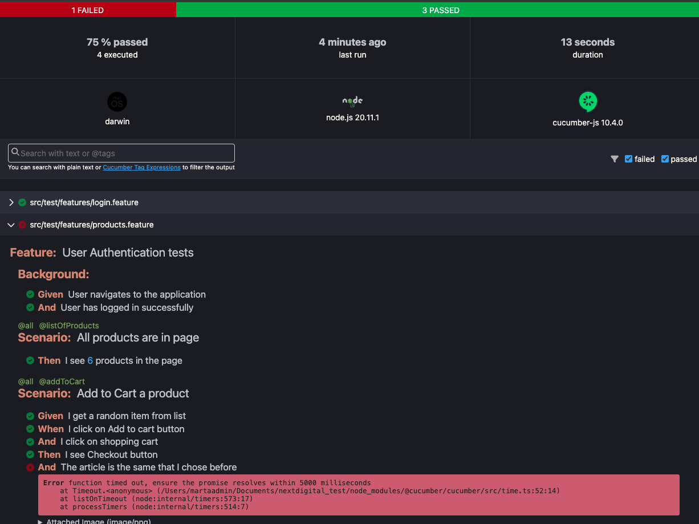

# Next Digital project

## Identification of possible main flow scenarios

The first scenario to check a user in all its variables, with correct user and password, correct user and incorrect password, verify that in each case the behavior is as expected:

The first scenarios that come to mind for testing are:

```
Scenario: Login should be success
   Given User enter the username as "standard_user"
   And User enter the password as "secret_sauce"
   When User click on "Login" button
   Then Login should be success


Scenario Outline: Login should not be success
   Given User enter the username as "<username>"
   And User enter the password as "<password>"
   When User click on "Login" button
   Then <result>


Examples:
   	| username      | password      | result                      |
   	| standard_user | wrong  	     | Login should not be success |
   	| wrong         | wrong         | Login should not be success |


Scenario: User should be blocked
   Given User enter the username as "locked_out_user"
   And User enter the password as "secret_sauce"
   When User click on "Login" button
   Then User should be blocked


Scenario: Performance should be correct
   Given User enter the username as "performance_glicth_user"
   And User enter the password as "secret_sauce"
   When User click on "Login" button
   Then Login should be success in less than X seconds
```
Once a user is correct, you must check that the content of the page is appropriate and that it is functioning correctly:

```
Scenario: Correct products are in page
   Given User logged successfully
   Then 6 products should be showed
   And Correct products should be showed
   Scenario: Add to Cart a product
   Given User logged successfully
   And I get a random item from list
   When I click on Add to cart button
   And I click on shopping cart
   Then I see Checkout button
   And The article is the same that I chose before


Scenario Outline: Order the products
   Given User logged successfully
   Then Products are in ascending alphabetical order 
   When User select "<orderType>"
   Then Products are in "<orderType>"


   Examples:
   	| orderType     		     |
   	| descending alphabetical order | 
   	| ascending price order	      |
 	| descending price order	      |
```

These are some examples that come to mind at first glance, there would be more like checking that the Logout is done correctly and the About and Reset App State menu links work as well.

Like the shopping cart, the Continue Shopping and Checkout buttons do their jobs well.

## QA report with test results

An htm report of the tests is configured in the project, it looks like this:



## Settings

Make sure to add the paths of the features and steps in the cucumber configuration options.

In the options ```cucumber.glue```, have to add: ```"src/test/features/*.feature"``` and ```"src/test/steps/*.ts"```

```
{
    "terminal.integrated.defaultProfile.osx": "bash",
    "cucumber.features": [
        "src/test/features/*.feature"
    ],
    "cucumber.glue": [
        "src/test/steps/*.ts",
    ]
}
```


### To launch the tests, use the following command:

```npm run tests````

#### To launch the tests by tags, use the following command:

```npx cucumber-js --tags @all --exit```


