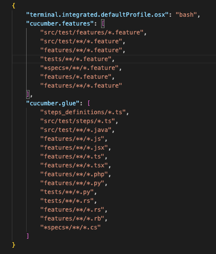

# Next Digital project

## Setup
Make sure to add the paths of the features and steps in the cucumber configuration options.

In the options ```cucumber.glue```, have to add: ```"features/*.feature"``` and ```"src/test/steps/*.ts"```

```
{
    "terminal.integrated.defaultProfile.osx": "bash",
    "cucumber.features": [
        "features/*.feature",
        "features/**/*.feature"
    ],
    "cucumber.glue": [
        "src/test/steps/*.ts",
    ]
}
```




### To launch the tests, use the following command:

```npm run tests````

#### To launch the tests by tags, use the following command:

```npx cucumber-js --tags @tag --exit```

#### Command for install env 

```npm i dotenv -D```
```npm i cross-env -D```

